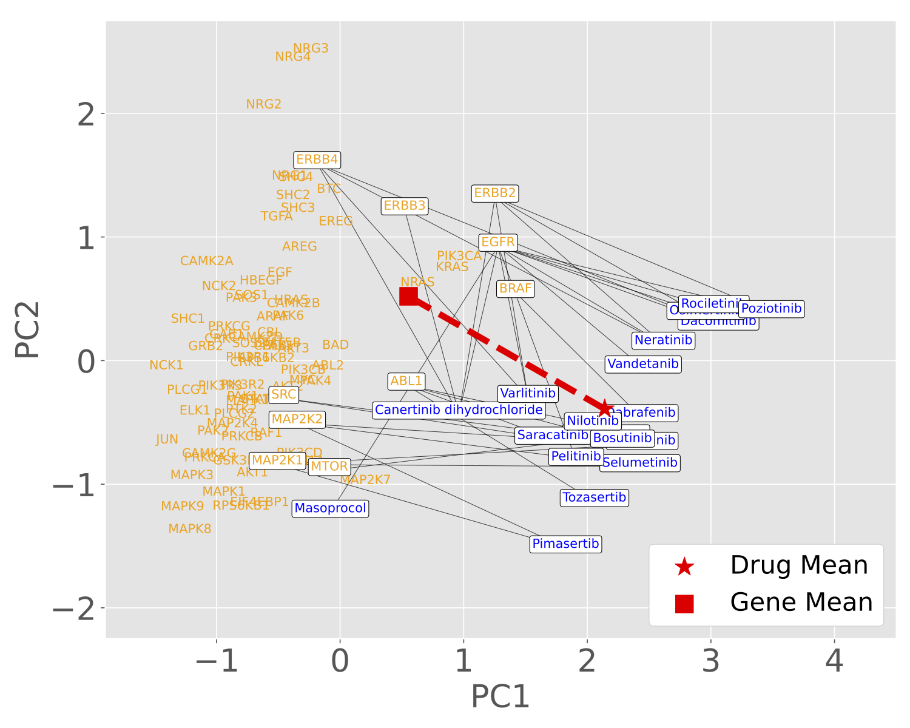

# Drug-Gene-Analogy

> [Predicting Drug-Gene Relations via Analogy Tasks with Word Embeddings](https://arxiv.org/abs/2406.00984)                 
> [Hiroaki Yamagiwa](https://ymgw55.github.io/), Ryoma Hashimoto, Kiwamu Arakane, Ken Murakami, Shou Soeda, [Momose Oyama](https://momoseoyama.github.io/), Mariko Okada, [Hidetoshi Shimodaira](http://stat.sys.i.kyoto-u.ac.jp/members/shimo/)                 
> *Preprint*



# Code
The source code is being organized and will be available soon. 

# Reference
- Chen et al. Bioconceptvec: Creating and evaluating literature-based biomedical concept embeddings on a large scale. PLoS Comput Biol. (2020).

# Citation
If you find our code or model useful in your research, please cite our paper:

```
@misc{yamagiwa2024predicting,
      title={Predicting Drug-Gene Relations via Analogy Tasks with Word Embeddings}, 
      author={Hiroaki Yamagiwa and Ryoma Hashimoto and Kiwamu Arakane and Ken Murakami and Shou Soeda and Momose Oyama and Mariko Okada and Hidetoshi Shimodaira},
      year={2024},
      eprint={2406.00984},
      archivePrefix={arXiv},
      primaryClass={cs.CL}
}
```